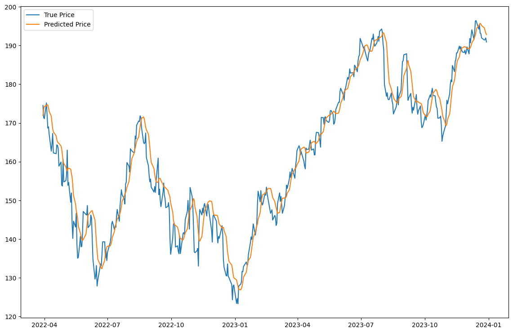

# Stock Price Prediction with LSTM

## Description
This project predicts stock prices using historical data and an LSTM (Long Short-Term Memory) neural network. The model learns patterns from past stock prices to forecast future prices.

## Features

Uses `AAPL` company data from public `yfinance` dataset. Dataset has stock data (open, high, low, close prices) and I only used `close` feature for the simplicity. Dataset range starts from 2015 to 2023 for 9 years.

LSTM-based model with two layers and dropout for regularization.

Data normalized and shaped for time-series prediction.

Visualizes predicted vs actual stock prices.

## Technologies

* Python 3
* TensorFlow / Keras
* NumPy, Pandas, Matplotlib

## How to Use

Install dependencies:

`pip install tensorflow numpy pandas matplotlib`

Run the notebook or script:

`python stock_price_prediction.py`

View the plot comparing predicted and actual prices.

## Note
This project is for learning and demonstration purposes. Stock price predictions are not financial advice.